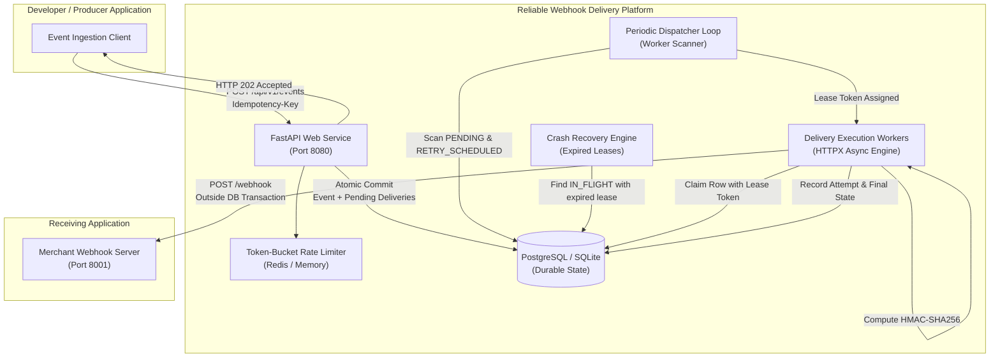
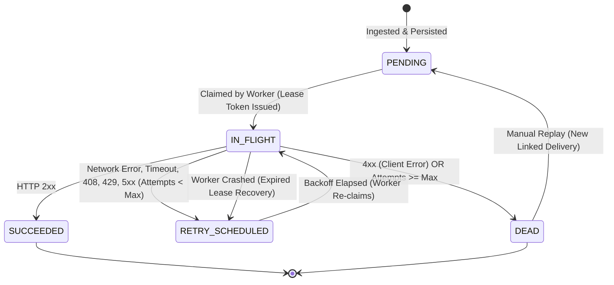

# Reliable Webhook Delivery Platform - Architecture Specification

This document provides a comprehensive technical overview of the Reliable Webhook Delivery Platform architecture, execution lifecycle, safety guarantees, and state transitions.

---

## 1. System Topology



---

## 2. Ingestion & Atomic Persistence Protocol

1. **Client Request**:
   - Header: `Authorization: Bearer wh_live_<entropy>`
   - Header: `Idempotency-Key: <unique_client_token>`
   - Body: `{"type": "payment.succeeded", "data": {...}}`
2. **Authentication & Rate Limiting**:
   - API key prefix lookup and constant-time SHA-256 hash comparison.
   - Per-project token bucket rate limiter (Redis atomic token bucket with in-memory fallback).
3. **Idempotency Verification**:
   - Check `(project_id, idempotency_key)` index in `events` table.
   - If key exists with identical SHA-256 payload hash $\rightarrow$ Return existing event record (`200 OK`).
   - If key exists with differing payload $\rightarrow$ Abort with `409 Conflict`.
4. **Atomic Transaction Boundary**:
   - In a **single database transaction**:
     1. Insert `Event` row (storing original `wire_payload` bytes for tamper-proof stability).
     2. Query active `endpoints` subscribed to matching `event_type`, `*`, or `prefix.*` (e.g. `order.*`).
     3. Insert a `Delivery` row (`status = PENDING`, `attempt_count = 0`, snapshot of destination URL) for each subscriber.
     4. Commit.
5. **Immediate Client Response**:
   - Return `HTTP 202 Accepted` with `event_id` and `delivery_count`.
   - **Crucial Invariant**: Outbound HTTP requests are never made on the synchronous ingestion path.

---

## 3. Delivery Lifecycle & State Machine



### State Definitions

| State | Meaning |
|---|---|
| `PENDING` | Initial state. Ingested durably, awaiting first delivery attempt. |
| `IN_FLIGHT` | Claimed exclusively by an active worker under an execution lease. |
| `SUCCEEDED` | Final terminal state. Target receiver returned HTTP 2xx. |
| `RETRY_SCHEDULED` | Transient failure occurred. Scheduled for next retry with backoff + jitter. |
| `DEAD` | Dead-letter collection. Either exhausted all retry attempts or received non-retryable 4xx. |

---

## 4. Lease Mechanics & Crash Recovery

To prevent concurrent delivery of the same webhook and ensure recovery if a worker process crashes mid-delivery:

1. **Claiming Phase**:
   - The worker runs an atomic query:
     ```sql
     UPDATE deliveries
     SET status = 'IN_FLIGHT',
         lease_token = :random_uuid,
         lease_expires_at = NOW() + INTERVAL '30 SECONDS'
     WHERE id = :delivery_id
       AND status IN ('PENDING', 'RETRY_SCHEDULED')
     ```
   - Only the worker that successfully claims the row proceeds.
2. **HTTP Dispatch (Outside DB Transaction)**:
   - Worker computes HMAC signature.
   - HTTP POST is sent with a **10-second timeout** (strictly shorter than the 30-second lease).
3. **Commit Phase**:
   - Upon completion, the worker updates the delivery row **only if** `lease_token` matches its assigned token.
4. **Crash Recovery Sweep**:
   - A background scanner periodically queries:
     ```sql
     SELECT id FROM deliveries
     WHERE status = 'IN_FLIGHT' AND lease_expires_at < NOW()
     ```
   - If found, the delivery is automatically reset to `RETRY_SCHEDULED`, preventing stuck tasks if a host dies or loses power.

---

## 5. Webhook Signing Specification

Every outgoing webhook request includes four standardized headers:

```http
Webhook-Event-Id: evt_48a92f085b3149ec
Webhook-Delivery-Id: dlv_9f82d1c04a28b173
Webhook-Timestamp: 1780000000
Webhook-Signature: v1=5d41402abc4b2a76b9719d911017c592b0c95029e46a7be7c77c68a41639d48e
```

### Signature Computation

1. **Payload Construction**:
   $$\text{signed\_payload} = \text{event\_id} + \text{"."} + \text{timestamp} + \text{"."} + \text{raw\_wire\_payload}$$
2. **HMAC Calculation**:
   $$\text{signature} = \text{HMAC-SHA256}(\text{endpoint\_secret}, \text{signed\_payload})$$
3. **Receiver Verification**:
   - Reject timestamps older than 5 minutes ($|\text{current\_time} - \text{timestamp}| > 300\text{s}$) to defeat replay attacks.
   - Compute expected HMAC and verify using constant-time comparison (`hmac.compare_digest`).

---

## 6. SSRF & DNS Rebinding Protection

Because developers register arbitrary target URLs, the platform implements multi-layer SSRF defenses:

1. **Scheme Validation**: Enforce `http` (development only) or `https` (production). Reject `file://`, `ftp://`, `gopher://`.
2. **IP Range Blacklisting**:
   - Loopback (`127.0.0.0/8`, `::1`)
   - Private RFC1918 (`10.0.0.0/8`, `172.16.0.0/12`, `192.168.0.0/16`)
   - Link-local (`169.254.0.0/16`, `fe80::/10`)
   - Multicast (`224.0.0.0/4`, `ff00::/8`)
   - Cloud metadata endpoints (`169.254.169.254`)
3. **DNS Rebinding Prevention**:
   - Hostname resolution is pinned prior to connection establishment.
   - Redirects are disabled (`follow_redirects=False`) to prevent open-redirect SSRF bypasses.
4. **Domain allowlist** (`ALLOWED_RECEIVER_DOMAINS`): optional exact-or-subdomain
   allowlist enforced at registration and at send time. Empty = disabled (dev).

---

## 7. Retry Schedule & Jitter

Transient failures retry according to exponential backoff with full randomized jitter:

$$\text{Delay}_n = \min\left(\text{MaxDelay}, \text{BaseDelay} \times 2^{n-1}\right) \times \text{Uniform}(0.5, 1.0)$$

If the receiver returns `HTTP 429 Too Many Requests` with a valid `Retry-After` header, the platform respects the receiver's requested interval within configured boundaries ($[1\text{s}, 3600\text{s}]$).

Product policy: `DEFAULT_RETRY_INTERVALS = [10, 30, 120, 600, 1800, 7200]`s (spec §7:
10s, 30s, 2m, 10m, 30m, 2h) with ±15% jitter and
`MAX_DELIVERY_ATTEMPTS = 5`. Demo policy (`USE_DEMO_RETRY_POLICY=True`) uses
`[2, 5, 10, 20, 40]`s for the recorded demo. `Retry-After` honors both
delay-seconds and HTTP-date forms, clamped to `[1s, 3600s]`.

---

## 8. Dispatch Concurrency, Timeouts, Observability, Retention

- **Concurrent dispatch**: `dispatch_batch()` fans out due deliveries on a bounded
  thread pool (`DISPATCH_MAX_WORKERS`, default 10, each with its own DB session),
  so one slow endpoint cannot head-of-line-block others. Celery workers use `-c 4`.
- **Timeouts**: connect timeout `HTTP_CONNECT_TIMEOUT_SECONDS` (3s) vs total
  `HTTP_TIMEOUT_SECONDS` (10s), both < lease `LEASE_DURATION_SECONDS` (30s).
- **Bounded reads**: streaming cap `MAX_RESPONSE_READ_BYTES` (64 KiB wire) +
  stored excerpt cap `RESPONSE_EXCERPT_MAX_BYTES` (1024 chars).
- **Tracing**: `start_trace_span()` wraps ingestion (`ingest.event`), dispatch
  (`dispatch.*`), delivery (`delivery.execute`, `delivery.http_post`), recovery and
  retention. `inject_trace_headers()` propagates W3C `traceparent`/`tracestate` on
  outbound webhooks. Set `OTEL_EXPORTER_OTLP_ENDPOINT` for OTLP export; otherwise no-op.
- **Logging**: JSON-structured to stdout (`app/services/logging_util.py`).
- **Retention**: hourly purge of terminal data older than `DATA_RETENTION_DAYS`
  (see `app/services/retention.py`, Celery `tasks.purge_expired_data`).
- **RBAC**: `owner`/`admin` may mutate endpoints, keys, replays and team;
  `member` is read-only. Owners manage admin roles; last owner cannot be removed.
